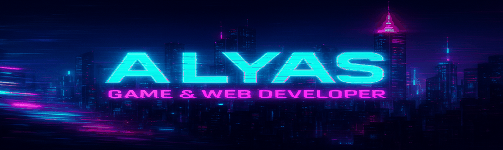

<!--

  

-->

<<<<<<< HEAD

=======

>>>>>>> b67704636151a08a8b9fd2204e36bb4c4c2ed799

<h1 align="center">👋 Welcome to my Cyber World 👾</h1>

---

### 🧠 About Me

- 🎓 Computer Engineering Student
- 🌐 Full-stack Web Developer (Flask & ASP.NET Core)
- 🚀 Scientific Research Developer (University of Isfahan projects)
- 🎮 Gamer and Indie Game Developer
- 🧠 Building worlds from my imagination into games

---

### 🔥 Skills & Tools

| Web Development | Game Development | Programming |
| :-------------: | :---------------: | :---------: |
| Flask (Python) | Unity (C#) | Python |
| ASP.NET Core (C#) | Unreal Engine (basic) | C#, CPP |
| Bootstrap, HTML/CSS | - | SQL Server |

---

### 🛸 Currently Working On

- Active Company Web Application (Maintenance & Updates)
- Personal 2D Indie Game

---

### ⚡ Quote

> **هستم اما خستم**

---

  

